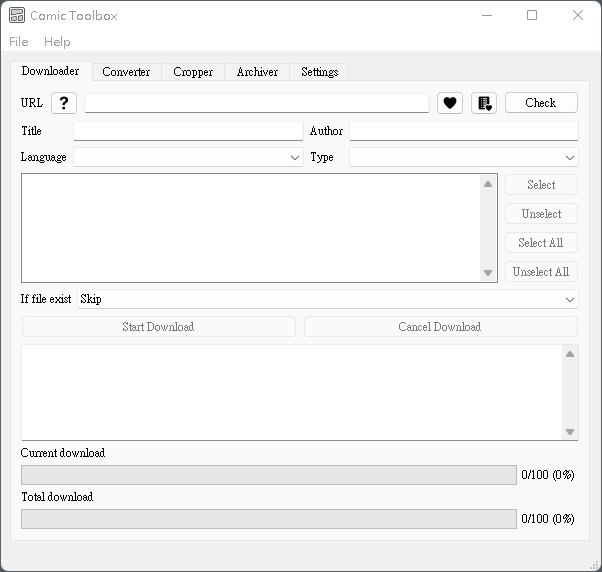

# Comic Toolbox ( Manga Toolbox )

[Chinese version please check this page (中文版請看這)](readmes/README_ZH.md)

## At the front

This tool is mainly for practicing Python before, and then I will change it when I have time, so the overall code is not very well written 😅 And because it is a learning work, sometimes you may find something strange or useless function in this tool? ! !

Another part of the functions may be more convenient and useful for users of e-ink e-book readers, because my original intention is to use it for my own Light 2 reader 😅

Please also be kind to the comics websites, if the site is broken, no one has to download it😅

Please set the crawler's delay time (in the setting interface) before starting the download. I am not responsible for the IP blocked by the website!

If you think this tool is helpful to you, please click star to follow, thank you for your support

If you encounter problems during use, please submit ISSUE

## Refer to

The crawler part has some code references from

- [ComicBook](https://github.com/lossme/ComicBook) by lossme (but doesn't seem to be maintained anymore)
- [ComicCrawler](https://github.com/eight04/ComicCrawler) by eight04
- [manhuagui-dlr](https://github.com/HSSLC/manhuagui-dlr) for HSSLC

Learn Python from Luo Hao's [Python - 100 days from novice to master](https://github.com/jackfrued/Python-100-Days) (still not finished yet😅 still a novice)

PyQt5 learned from buzzing [this year is still not enough money to buy psQQ, let's use PyQt to write one by ourselves](https://www.wongwonggoods.com/category/portfolio/13th_ironman/)

QSS dark theme refers to [QSS-Skin-Builder](https://github.com/satchelwu/QSS-Skin-Builder) of Schoolbag

Some icons are from [Icons8](https://icons8.com/icon/set/show/ios-glyphs)

## Support site

- 動漫狂 `www.cartoonmad.com`
- 無限動漫 `www.comicabc.com`
- 动漫屋 `www.dm5.com`
- 酷漫屋 `www.kumw5.com`
- 漫畫柜 `www.mhgui.com`
- Read Comic Online (American manga) `readcomicsonline.ru`
- WEBTOON (Korean manga) `www.webtoons.com`

## Main features

- [x] Full GUI interface operation
- [x] Comic batch download
- [x] Bookmark function (more convenient to follow)
- [x] Sub-categories are stored by chapter/volume/extra
- [x] Support proxy function
- [x] Batch conversion of images (such as webp, gif, png to jpg)
- [x] Batch processing of pictures (such as changing contrast, brightness, sharpness, color, supporting Real-CUGAN AI enhancement, which is helpful for older comics)
- [x] Batch cropping of pictures (supports the integrated cropping of common Japanese manga covers, 2-page integrated cropping, semi-automatic fine-tuning, convenient for e-book readers)
- [x] Compression tool: support to generate cbz, epub, pdf, zip, docx (multiple chapters can be combined into one file)
- [x] Reader, supports multi-level subdirectory diversity / CBZ / ZIP / PDF, can set different number of pages, reading order from left to right or right to left, picture ratio, reading method: page or full page Vertical (convenient for Korean comics), support bookmark reading progress, full screen reading

## Install / upgrade steps

Personally developed in Python 3.9 in Windows 11, here is the reference

### Install Python

The installation file can be downloaded from the official Python website [https://www.python.org/](https://www.python.org/).

Remember to select "Add python.exe to path" when installing to use the pip command.

### Install Node.js

Some web crawlers use Node.js to analyze JavaScript.

The installation file can be downloaded from the official Node.js website [https://nodejs.org/](https://nodejs.org/).

## Interface Introduction

Download tool

Reader

Conversion tool

Crop tool

Compression tool

Image processing

Image cropping

Settings - Prevent Banned

Bookmarks (some I'm watching, some I'm testing 😅 )

Dark theme

2 times the Real-CUGAN noise reduction effect (the left is the original image, the right is the rendering)

## Notice

For Convert Tool, Crop Tool, Compress Tool, please select the folder of the comic series before scanning\
E.g:\
📁 d:\comics\ (download folder)\
📁 d:\comics\book_name\ (folder of series)\
📁 d:\comics\book_name\chapter-##\ (chapter/volume folder)\
🖼 d:\comics\book_name\chapter-##\\###.jpg (image file)

The conversion tool destination folder is suggested to be different from the source folder, even though it should be fine, but to be on the safe side 😅

## Notes

It's okay to take the program casually, but please don't take it as your own, thank you!

It is only for academic research and exchange, respect copyright, please support genuine, and resources downloaded or generated through this tool** are prohibited from spreading and sharing! It is forbidden to use this project for commercial activities! **

## At the end

Because it is a work that is half-studied and half-written, there must still be many deficiencies. There must be bugs, and there may be quite a few. Welcome to submit issues. Because it is a personal free work, the response to corrections is relatively slow.

~~Want to add Proxy support, but I couldn't find a good free Proxy online~~ (I used the locally installed proxy test in the end)

~~In addition, if you have time, tidy up the code, such as useless imports, requirements and the like~~

## Feelings

Python is easy to get started, but difficult to advance 😅

QtDesigner is really useful

OpenCV should be faster than Pillow, but a lot of sin, cos, and tan are difficult to use for those who have passed junior high school for many years!

## New version update

### v0.8.0

- Added the manga reader!

### v0.7.0

- Added green theme
- Some code corrections, batch cropping of pictures to join full-screen mode
- Add rotation, horizontal flip, vertical flip to image batch processing
- Added support for [Real-CUGAN](https://github.com/nihui/realcugan-ncnn-vulkan) (good for old comics, not very useful for new high-definition comics)
- Added new support site `www.webtoons.com`

### v0.6.5

- Added the function of generating docx
- Added dark theme
- Reorganized some code of crawler, and reorganized dependencies
- Added new support sites `www.dm5.com` `readcomicsonline.ru`

### v0.6.0

- Added support for proxy (Proxy) function

### v0.5.5

- Add bookmark function
- Add a little more Tooltips description

### v0.5.0

- First edition