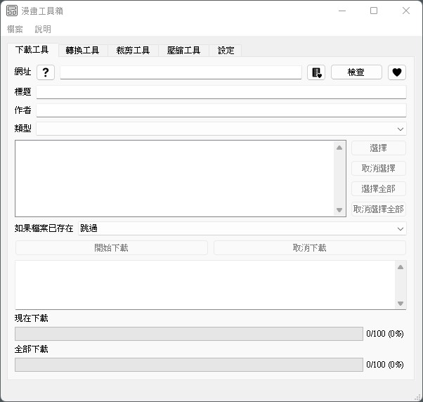

# Comic Toolbox 漫畫工具箱

## 寫在前頭

這個工具主要是之前學習Python的練手作，然後有空時會改改，所以整體代碼不是寫得很好😅而且因是學習之作，所以有時你可能會在本工具中發現一些奇怪或無用的功能？！！

另部分功能可能比較偏向方便有用e-ink電子書閱讀器的用者，因我原意是自用的，來給自己的Light 2閱讀器的😅

爬蟲現在只支援動漫狂、酷漫屋、漫畫柜、無限動漫站點下載（因爬蟲部分寫的不夠模組化，比較亂，等之後改良再加多其他站點吧）

另請善待各大漫畫網站，玩壞了，大家都沒得下載了😅

請在開始下載之前，自行設定好爬蟲停留時間（在設定介面），本人對被網站封IP不負責哦！

如果覺得本工具對你有所幫助，請點個star關注，感謝支援

如有使用中遇到問題，歡迎提ISSUE

## 參考

爬蟲部分有部分代碼參考自 

- lossme 的 [ComicBook](https://github.com/lossme/ComicBook) （但好像不再維護了）
- eight04 的 [ComicCrawler](https://github.com/eight04/ComicCrawler)
- HSSLC 的 [manhuagui-dlr](https://github.com/HSSLC/manhuagui-dlr)

Python 學習自 骆昊 的 [Python - 100天从新手到大师](https://github.com/jackfrued/Python-100-Days) （仍未學完😅仍是新手）

PyQt5 學習自 嗡嗡 的 [今年還是不夠錢買psQQ，不如我們用PyQt自己寫一個](https://www.wongwonggoods.com/category/portfolio/13th_ironman/)

部分圖示來自 [Icons8](https://icons8.com/icon/set/show/ios-glyphs)

## 本工具特點

- [x] 全GUI介面操作
- [x] 漫畫批量下載
- [x] 書簽功能 （ 追更比較方便 ）
- [x] 分目錄按章節／卷／番外儲存
- [x] 圖片批量轉檔 （ 例如 webp、gif、png 轉成 jpg ）
- [x] 圖片批量處理 （ 如改對比度、亮度、銳化度、色彩， 對比較舊的漫畫有點幫助 ）
- [x] 圖片批量裁剪 （ 支持常見的日式漫畫封面一體化的裁剪，2頁一體化的裁剪，可半自動微調，方便電子書閱讀器 ）
- [x] 支援產生 cbz、epub、pdf、zip （ 可多章節合併成一個檔案 ）

## 安裝／升級步驟

個人是在 Windows 11 中的 Python 3.9 開發的，以下是參考

### 安裝 Python

安裝檔可以從 Python 官方網站 [https://www.python.org/](https://www.python.org/) 下載。

安裝時記得要選「Add python.exe to path」，才能使用 pip 指令。

### 安裝 Node.js

部分網站的爬蟲使用 Node.js 來分析 JavaScript 。

安裝檔可以從 Node.js 官方網站 [https://nodejs.org/](https://nodejs.org/) 下載。

## 介面簡介

下載工具

轉換工具

裁剪工具

壓縮工具

圖片處理

圖片裁剪

## 注意

對於轉換工具、裁剪工具、壓縮工具，請在掃描前選擇漫畫系列的文件夾\
例如：\
📁 d:\comics\  (下載文件夾)\
📁 d:\comics\book_name\  (系列的文件夾)\
📁 d:\comics\book_name\chapter-##\  (章節/卷文件夾)\
🖼 d:\comics\book_name\chapter-##\###.jpg  (圖像文件)

轉換工具目標文件夾建議與源文件夾不同，即使應該沒問題，但為了安全起見😅

## 附註

程式隨便拿沒關係，但請不要把他當成自己原創的，謝謝！

僅供學術研究交流使用，尊重版權，請支援正版，通過本工具下載或產生的資源**禁止傳播分享！禁止利用本專案進行商業活動！**

## 寫在後頭

因是半學習半編寫的作品，所以一定仍有很多不足的地方，臭蟲(bug)一定是有的，而且可能不少，歡迎提交 issue，因是個人空閒的作品，所以修正回應比較慢啦

想加入Proxy的支持，但線上沒找到一個好用的免費的Proxy

另外如有空，再把代碼整理一下吧，如無用的 import，requirements 之類的

之前在寫初期command line時有加入 [Real-CUGAN](https://github.com/bilibili/ailab/tree/main/Real-CUGAN) 的AI 圖片強化，對舊漫畫效果是不錯，花時間是比較久，但在我的老電腦 GTX 1660 中，經常掛掉，應是GPU Memory 不足，因比較難測試，所以 GUI 就先拿掉了

## 感想+隨想

Python 入手挺容易的，但想進階挺難的😅

QtDesigner 真的挺好用的

OpenCV 應該比 Pillow 快，但好多 sin、cos、tan，對初中已過去好多年的人覺得好難用啊！

## 版本更新

### v0.5.5

- 加入書簽功能
- 加入多一點 Tooltips 說明
